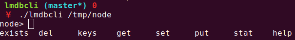

[](https://travis-ci.org/spacewander/lmdbcli)
[](http://goreportcard.com/report/spacewander/lmdbcli)
[](https://codecov.io/github/spacewander/lmdbcli?branch=master)
[](https://github.com/spacewander/lmdbcli/blob/master/LICENSE)

## Feature

* Support CRUD commands in repl-like command line. You can consider it as `redis-cli` for lmdb.
* You can eval Lua script with given database. It makes maintaining lmdb more easily.

Feel free to create an issue or pull request if you think this tool could be improved to satisfy
your requirements.

## Installation

`go get -u github.com/spacewander/lmdbcli`

In this way you will install the lmdbcli works well with latest lmdb (0.9.24).

If you are using an old version of lmdb, you need to change the `lmdb-go`'s version
in `go.mod`, and rebuild.

Currently supported version (tested):
* 0.9.24
* 0.9.21

Please run `go test ./...` to confirm if the lmdbcli works with your lmdb version.

Note that the lmdb binding is writtern via `cgo`.
If you get `GLIBC_XX symbol not found` error when running the binary,
you need to rebuild it in correspondent environment to fix the dynamic symbol.

## Usage

`lmdbcli  [-e script] /path/to/db`

## Commands

```
$ ./lmdbcli /tmp/node
node> help
stat) STAT get mdb_stat with 'stat' or 'stat db'
exists) EXISTS check if a key exists with 'exists [db...] key'
values) VALUES lists all keys and their values matched given glob pattern with 'values [db...] pattern'
del) DEL remove a key with 'del [db...] key'
keys) KEYS lists all keys matched given glob pattern with 'keys [db...] pattern'
get) GET a value with 'get [db...] key'
set) SET a value with 'set [db...] key'
put) PUT is an alias of SET
node> ? # type '?' works the same as 'help'
...
```

## Lua support

You could run a lua script on specific database like this: `lmdbcli -e your.lua db_path`.
`lmdbcli` provides a couple of API within the global variable `lmdb`. For example:
```lua
lmdb.get("key") -- return the value of `key` as a lua string
-- is equal to `> get key` in the command line
```

See [test.lua](./test.lua) as a concrete example.

### Lua utility functions

To avoid writing/copying common Lua snippets, we provide some builtin utils function
exported via `lmdb.utils` table.

#### local str = tohex(str)

Encode input string via base32. It could be used to format MD5 binary value.
